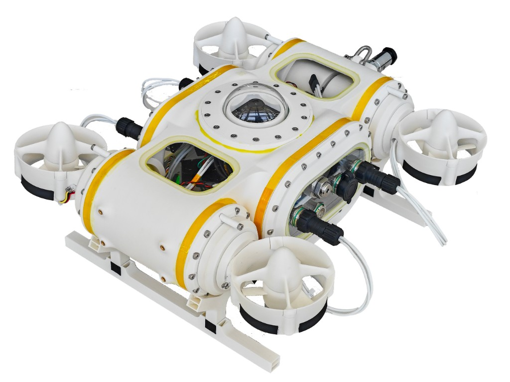
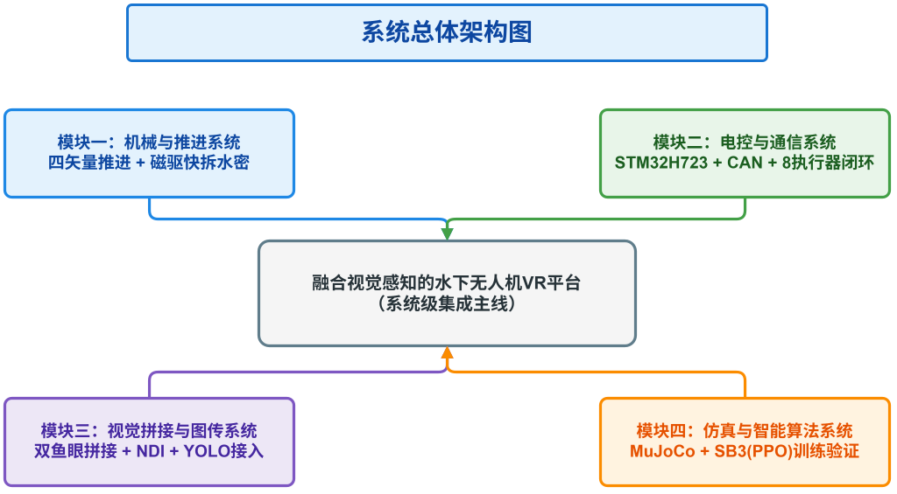
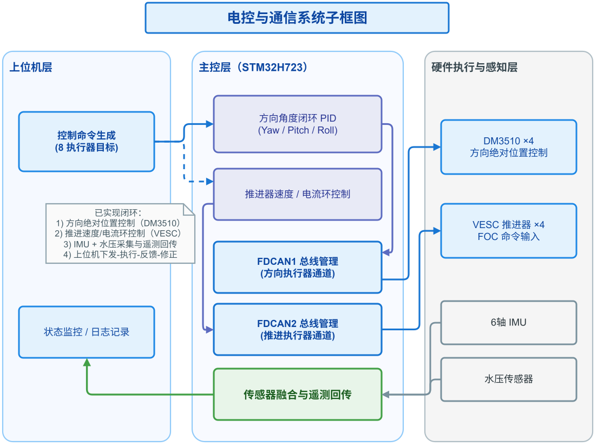
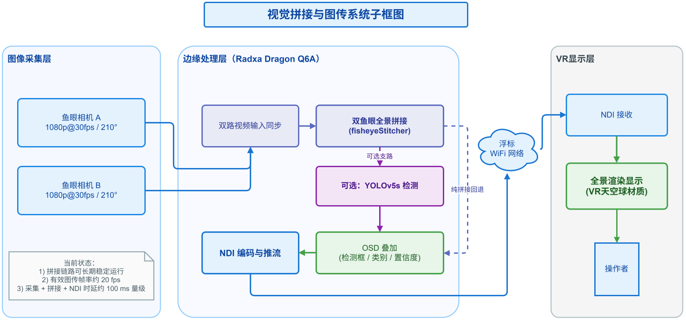
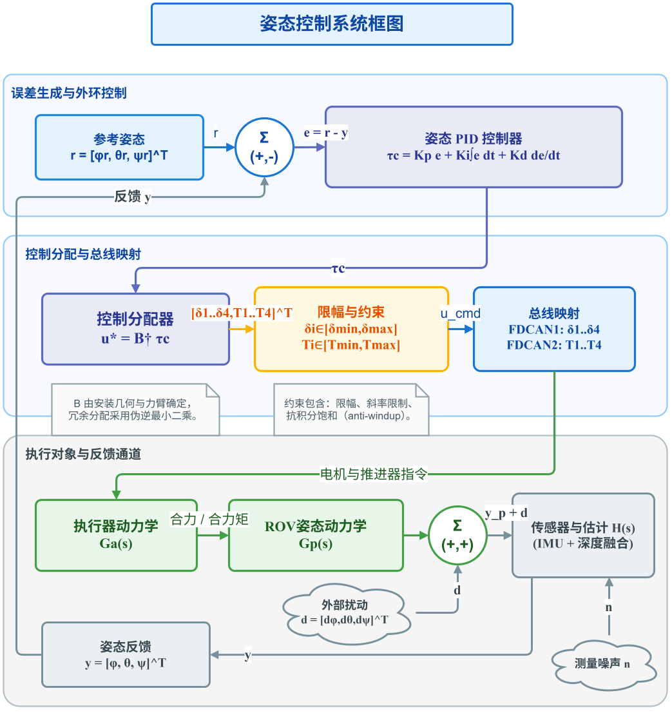

# VectorROV

**Languages:** [English](README.md) · [中文](README.zh-CN.md)

Open-source **tethered underwater ROV** platform built around **four vectored thrusters**, **dual fisheye panoramic perception**, and a VR-oriented teleoperation stack. This repository accompanies a **graduate design project** ([Fujian University of Technology](https://www.fjut.edu.cn/) · Computer Science) that stitches together mechanics, embedded control, edge vision/streaming, and simulation-based control experiments.

The vehicle targets highly maneuverable motion with an **8-actuator** layout (four steering motors + four thrusters) and leaves room for **dual expandable 6‑DOF manipulators** (see [TODO](#todo)).

---

## 🤖 Prototype at a glance

  

<em>Physical prototype: four shrouded thrusters, sealed hull & domes, skid landing gear, and bulkhead interfaces for tether/power.</em>

---

## ✨ Highlights

- **🧭 Four-vector propulsion** — vectored thrusters for richer force/moment authority; magnetic quick-release watertight passages for maintenance (see thesis mechanical chapter).
- **⚙️ STM32H723 + CAN** — dual **FDCAN** buses: steering (DM3510 class) vs. propulsion (**VESC / FOC**); IMU + pressure feedback for closed-loop state estimation.
- **👁️ Panorama → NDI → VR** — dual fisheye **stitch** on a **Radxa Dragon Q6A**-class edge node, **NDI** streaming, buoy Wi‑Fi hop to headset; lightweight **YOLO**-style detection with a “edge primary / client fallback” path.
- **🎮 MuJoCo + SB3** — simulation environment for control validation and **reinforcement-learning** experiments (Stable-Baselines3), aligned with the same action/state semantics as the real stack where possible.
- **🧰 CAD & tooling** — `hardware/` mechanical sources; `tools/OpenProp/` for propeller/motor analysis workflows.

### Measured/Pilot metrics (lab)

From integrated testing described in the thesis: panoramic pipeline about **~20 fps**, **capture → stitch → NDI** latency about **&lt;100 ms** (before headset render); single thruster thrust roughly **8–10 N** (estimated range).

---

## 🏗️ Architecture diagrams

High-level views aligned with the thesis (SVG sources under `assets/diagrams/`).

| System overview (Ch.2) | Electronics & comms (Ch.2) |
|:-:|:-:|
|  |  |

| Vision & streaming (Ch.2) | Attitude control & allocation (Ch.4) |
|:-:|:-:|
|  |  |

---

## 🗂️ Repository layout

> The exported tree (`tree.txt`) includes local virtualenvs (`.venv`) and full **Keil/STM32** driver trees under `firmware/`—clone `.gitignore` accordingly before committing.

| Path | Role |
|------|------|
| `assets/diagrams/` | Thesis figures (SVG): architecture, subsystems, simulation |
| `assets/img/` | Photos & renders (e.g., prototype) |
| `firmware/` | `CtrBoard-H7_CAN/` (H7 main), `F103C8T6/`, `N630/` — USB/CAN/motor control |
| `hardware/` | CAD & part sources (shells, thrusters, connectors, arms, etc.) |
| `control/MuJoCoSim/` | MuJoCo scenes, training scripts, logs/models for SB3 experiments |
| `pytest/` | Python-side checks (may ship a local `.venv`) |
| `tools/OpenProp/` | OpenProp examples & sources for prop analysis |

---

## 🚀 Getting started (pointers)

- **Firmware:** Open `firmware/CtrBoard-H7_CAN/MDK-ARM` in **Keil MDK** (STM32H7). Expect long build trees—work from CubeMX-exported project files already in-repo.
- **Simulation / RL:** See `control/MuJoCoSim/` — create a clean virtual environment, install MuJoCo / Gymnasium / Stable-Baselines3 stack as used by the training scripts there, then run training or evaluation entrypoints (see files under `train/`).
- **Vision / NDI / edge:** Runtime primarily targets the **Q6A** edge device for stitching & inference; VR display assumes a receiver path (e.g., NDI + headset app). Treat this repo as the **system reference + firmware/hardware/sim** anchor; edge images may live on device or separate release artifacts.

---

## 🎓 Academic context

This platform is developed as a **final-year capstone / graduation design** project:

**“Design and Implementation of an Underwater ROV VR Platform with Integrated Visual Perception.”**  
It emphasizes **end-to-end integration**—mechanics, embedded control, panoramic vision, and simulation—rather than a single algorithmic benchmark. A full narrative, equations, and experiment logs appear in the student thesis manuscript (not shipped in this repo as required reading).

---

## TODO

Work that is **partially done**, **not production-ready**, or **not yet started**:

- [ ] **Reinforcement learning** — expand SB3/MuJoCo training, reward design, sim-to-real safeguards, and logging/replay for the physical ROV.
- [ ] **Dual 6‑DOF manipulators** — mechanical integration, water‑tight routing, arm control stack, and teleoperation UX (hardware CAD folders exist; full arm workflow is incomplete).
- [ ] **Meta Quest 2 VR client** — production-quality **Quest 2** client (latency-hardened rendering, interaction, connectivity with NDI/stream stack); **little or no** usable client is in-tree yet.

Contributions and issue reports are welcome.

---

## 📄 License

This project is released under the **MIT License** — see [`LICENSE`](LICENSE).

---

## 🙏 Acknowledgements

Thanks to thesis advisors and lab partners who supported machining, wet testing prep, and embedded bring-up. Third-party MCU stacks (STM32 HAL, FreeRTOS, USB stacks) remain under their respective licenses inside `firmware/`.
